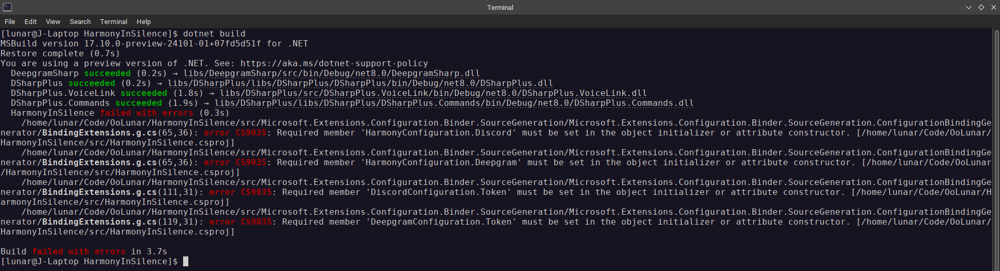

# Day 1

## Summary
As I’m starting my project from scratch, I figured now would be a good time to re-evaluate my normal project template. From complete scratch, I focused on making my Program class more DI-centric and to better follow good DI conventions.

Now I have a neat Hello World Discord bot ready to be easily expanded upon with new commands.

## Table of Contents
- [Summary](#summary)
- [Details](#details)
  - [Configuration](#configuration)
  - [Dependency Injection](#dependency-injection)
  - [Conclusion](#conclusion)

## Details
There's quite a few changes to go over! For those who like to compare and contrast, here's my normal "default" project template: [DSharpPlus.Template](https://github.com/OoLunar/DSharpPlus.Template/tree/25682ee179126b62abb9b8a24b5f06482e49e44f)

### Configuration
Now right away with the configuration, instead of grabbing properties by name I bind them to a class. The differences between the two are quite stark:

```csharp
// Old way
var token = config.GetValue<string>("Discord:Token");

// New way
var token = config.Discord.Token;
```

However this seemingly simple change proved to be quite difficult. Taking a look at [`Microsoft.Extensions.Configuration.Binder`'s README](https://www.nuget.org/packages/Microsoft.Extensions.Configuration.Binder/8.0.1#readme-body-tab), you can see that they offer a `EnableConfigurationBindingGenerator` compiler option. In theory, this would mean that my configuration deserialization logic would be generated at compile time. Having deserialization logic ready at compile time normally means a boost in performance - a performance boost that seemed to be free by simply enabling a compiler option.

Now it should be noted that I haven't had the chance to mess with AOT (Ahead Of Time) compilation before, at least not in any meaningful way. Typically I'm stuck with dependencies that heavily rely on reflection - JSON.NET being the most common example. Since a single dependency was not AOT-compatible, I've never been able to use AOT within my own application. Since I'm only using the source generator on one specific part of my application, I figured I'd give it a shot. However immediately upon enabling it, I was hit with a specific compiler error:



Hm. Taking a look at my configuration classes, we see the following:

```csharp
namespace OoLunar.HarmonyInSilence.Configuration
{
    public sealed record HarmonyConfiguration
    {
        public required DiscordConfiguration? Discord { get; init; }
        public required DeepgramConfiguration? Deepgram { get; init; }
        public LoggerConfiguration Logger { get; init; } = new();
    }
}
```

I use C# 11's `required` keyword, a feature that's been available since .NET 7. Taking a look at how `required` works, it does not appear to be a feature that's supported by AOT - I suspect that's because it's a feature that's enforced at runtime. Take a look at the required members specification in the [C# 11 language proposal](https://learn.microsoft.com/en-us/dotnet/csharp/language-reference/proposals/csharp-11.0/required-members), I encourage you to read the entire proposal but here's a snippet that I think is relevant:

> All constructors in a type with required members, or whose base type specifies required members, must have those members set by a consumer when that constructor is called. In order to exempt constructors from this requirement, a constructor can be attributed with `SetsRequiredMembersAttribute`, which removes these requirements. The constructor body is not validated to ensure that it definitely sets the required members of the type.

> `SetsRequiredMembersAttribute` removes all requirements from a constructor, and those requirements are not checked for validity in any way. NB: this is the escape hatch if inheriting from a type with an invalid required members list is necessary: mark the constructor of that type with `SetsRequiredMembersAttribute`, and no errors will be reported.

Hm, so the `required` keyword *can*  be side-stepped by adding `SetsRequiredMembersAttribute` to a constructor. This tells me that the feature is almost certainly enforced at runtime.

Alright, so the simple solution is to remove `required`. That makes my configuration classes look like this:

```csharp
namespace OoLunar.HarmonyInSilence.Configuration
{
    public sealed record HarmonyConfiguration
    {
        public DiscordConfiguration? Discord { get; init; }
        public DeepgramConfiguration? Deepgram { get; init; }
        public LoggerConfiguration Logger { get; init; } = new();
    }
}
```

Oh hey! My program compiles.

And it immediately exits.

Looking at the logs, I see the following:

> ```
> Logging is not set! Exiting...
> ```

Mhm. Now, if I recall correctly, all the properties on my logging class have default values. So even if I don't explicitly provide configuration values for my logging, the default values should be used as a fallback. Taking a deeper look at the configuration object in the debugger, I see that all of my properties are `null`. That's odd. I'm using the `Microsoft.Extensions.Configuration.Binder` package, and I'm binding my configuration to a class. I'm not sure why my properties are `null`.

Once more, I reference [`Microsoft.Extensions.Configuration.Binder`'s README](https://www.nuget.org/packages/Microsoft.Extensions.Configuration.Binder/8.0.1#readme-body-tab). Looking at their example, I see that their properies all have public set accessors - bad practice that libraries usually avoid at all costs, but I'm not a library and certainly nobody will be executing my application code as part of another application. Replacing all the `init` accessors with `set` accessors, I see that my program compiles and runs as expected:

```csharp
namespace OoLunar.HarmonyInSilence.Configuration
{
    public sealed record HarmonyConfiguration
    {
        public DiscordConfiguration? Discord { get; set; }
        public DeepgramConfiguration? Deepgram { get; set; }
        public LoggerConfiguration Logger { get; set; } = new();
    }
}
```

It seems even `private set` accessors work as intended. I attempted to browse through `Microsoft.Extensions.Configuration.Binder`'s source code to see if I could find any clues as to why `init` accessors don't work as expected, but I was unable to find anything. I'll leave it as a mystery for now.

Looking at my configuration classes, I see that I can't stick to my preferred read-only objects, a programming style that I enjoy using as it enforces immutability. I'm not sure if I'm willing to give up immutability for the sake of a source generator.

So let's try disabling the source generator and see if my program still compiles and runs. It does. Both the `required` keyword and `init` accessors work as expected. Considering the pros and cons of the source generator, I think I'll stick with my reflection based approach. Yes, the configuration objects are created through reflection, however I'm only creating these objects once at startup. The performance hit is negligible, and I'm able to keep my preferred programming style.

### Dependency Injection
Now that I have my configuration sorted out, I can move on to the next part of my application. Using Asp.Net as an example, I've created a `Program` class that's more DI-centric. All of my objects are stored as singleton services: my configuration, my logging, my Discord clie- wait a minute. My Discord Client singleton has an async modifier. This means that my `AddSingleton` delegate isn't returning a `DiscordShardedClient` but rather a `Task<DiscordShardedClient>`. I did some Googling around to see if DI had any asynchronous support, however my answer wasn't a yes or no answer, but rather a "your design is wrong from the start". [Steven's answer on StackOverflow](https://stackoverflow.com/a/43240576/10942966) helped me a lot:

> Although it is theoretically possible to use async/await during object resolution, you should consider the following constraints:
>
> - [Constructors can't be asynchronous](https://stackoverflow.com/questions/8145479/can-constructors-be-async), and
> - Construction of object graphs should be [simple, reliable and fast](https://blog.ploeh.dk/2011/03/03/InjectionConstructorsshouldbesimple/)
>
> Because of these constraints, it's best to postpone everything that involves I/O until after the object graph has been constructed.
>
> So instead of injecting a connected `MyClient`, `MyClient` should connect when it is used for the first time - *not when it is created.*

Alright, so my DI delegates should be focused on creating objects, not configuring them. What I'll do is remove the async code out of the delegate and into the main program itself. I need to grab the Discord client in the `Main` method logic anyways to start the bot, so it's not a big deal.

### Conclusion
I've made quite a few changes to my project template. Learning a new `Microsoft.Extensions.Configuration.Binder` feature, I've redesigned my configuration classes to be slightly more DI-friendly. Finally, I learned more about how the DI concept is intended to be used. I'm excited to see how these changes will affect my project in the long run.

Here's what I want to work on tomorrow:
- [ ] Setup a `/join` command to join voice channels.
- [ ] Update the DeepgramSharp library to support the latest Deepgram API features.
- [ ] Designing a system to efficiently send transcriptions in bulk to Discord.