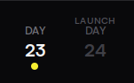

# Day 23
## Summary

It's been...

Two weeks! Since I've last contributed to this project. A lot of my effort has been on the [`DSharpPlus.Commands`](https://github.com/DSharpPlus/DSharpPlus/commits/master/?author=OoLunar&since=2024-03-05&until=2024-03-19) framework, along with an irl job, along with general burnout. However, those who are observant will notice that...

## Table of Contents
- [Summary](#summary)
- [Details](#details)
  - [THE DEADLINE IS TOMORROW](#the-deadline-is-tomorrow)
  - [Live Subtitles](#live-subtitles)
  - [The Current State](#the-current-state)
- [Conclusion](#conclusion)

## Details

### THE DEADLINE IS TOMORROW

I am way behind schedule. There's supposed to be an incredibly efficient way to manage multiple speakers in voice channels. There's supposed to be a website which printed out the transcriptions live. There might've been a moderator dashboard that recorded all the text.

And none of is has been done. In fact, it doesn't even *work*  right now.

So I'm gonna have to dramatically shift my goals here. Let's get my product working, then we can get to optimizing. Once we optimize, we can provide live subtitles.

Oh. Live subtitles.

### Live Subtitles

As I've mentioned in previously updates, I desired a way to provide live subtitles to the users *in Discord.*  This could've been done by sending normal text messages inside of the VC... Or it could've been done by the bot streaming a video of the text. Except bots can't stream videos, and sending text messages will be throttled by ratelimits.

But it's okay! My two weeks of procrastination has paid off! Discord recently announced a new feature: [The Embedded App SDK](https://github.com/discord/embedded-app-sdk). This is great, because it allows us to create our own little games in VC's. Except, it's not limited to games. All Discord provides is an iframe. Despite the numerous vulnerabilities that have come from iframes... We get to take full advantage of it!

Discord using iframes for activities is actually a really good thing *for me.*  It means I can just embed my website into the VC. This means I only have to write my web code once, and it'll work in Discord seemlessly!

Except we're getting way ahead of ourselves. Let's get the bot working first.

### The Current State
Right now, the only thing the bot can do is join and leave VC's. When a user speaks, the bot doesn't do anything yet. Instead of shoving all of the users into a single connection, I'm going to create a new connection for each user. This is a temporary solution but it saves time. I can optimize later.

Once the user joins VC, they speak. The user gets added to the user map and a new connection is made. When the user speaks, their audio gets sent to Deepgram and the transcription is sent to the voice channel via text.

...in theory. In practice, there were numerous issues:
- Most API's that make use of `CancellationToken` just *love*  to throw exceptions when the token is cancelled.
- I told Deepgram that I was sending Opus data. Discord sends Opus data, so it makes sense why we'd send Opus data. Except we don't. `DSharpPlus.VoiceLink` decodes the Opus data into PCM 16-bit data, a form that's much more friendly to work with. I forgot I implemented that.
- Deepgram requires two things in order to keep the connection alive: A keep alive packet every 12 seconds, and audio data every 10 seconds. `DeepgramSharp` handles the keep alive for me. However I was completely unaware of the 10 second requirement.
- I had to rewrite some of the `DeepgramLivestreamApi` internals. Compared from when I first wrote it, I learned how to use `System.IO.Pipelines` with `System.Text.Json` a bit more. This lead to a much cleaner implementation. Additionally, I was locking all operations on the connection when performing any read or write operation on the websocket. Now, I only lock when sending data to the websocket, as reading from the websocket is perfectly thread safe.
- Somehow, I was reading the same audio data multiple times. `System.IO.Pipelines` threw a fit about that.
- I separated the sending and receiving of transcriptions into their own background tasks. Sending audio data could lead to multiple responses from Deepgram, and I didn't want to block the audio sending task due to rest API requests to Discord.

And the most frustrating issue of them all: I was sending a silent Opus packet instead of a silent PCM 16-bit packet. This was my biggest issue, because instead of simply not receiving the transcriptions like before, I was now receiving *empty*  transcriptions! Deepgram *knew*  when someone started/stopped speaking, however it didn't know what they were saying due to the incorrect silence packets.

You can almost hear the frustration in my subtitles. 8 hours of debugging due to that specific byte array.

## Conclusion
What now? Well, technically I *could*  deploy but. There's a global 100 user speaker limit. That's pretty restrictive. My next goal is to clump multiple users into a single connection, and then balance the users across the connections. I also need to disconnect the bot once there's no users in the VC. And when the bot is disconnected by an admin. So many things to do!