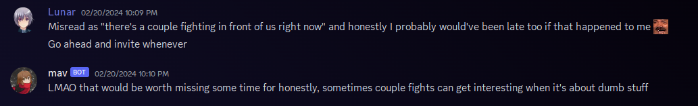
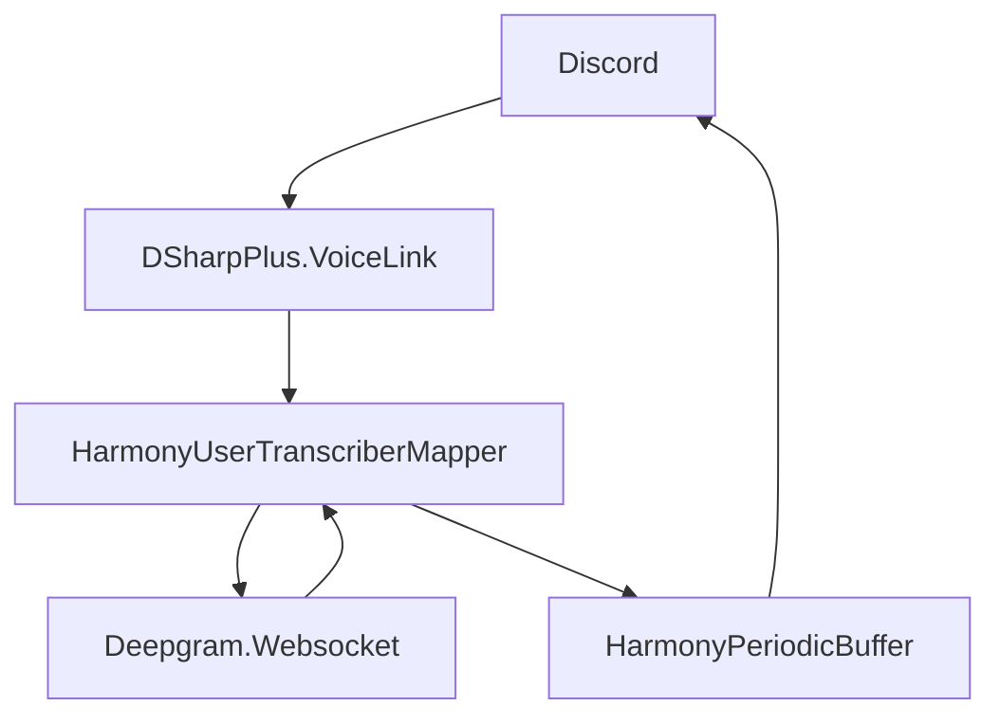

# Day 3

## Summary
Docker support was added! An official logo and resource files were created. The project is licensed under MIT, though contributing to this project specifically is preferred. Additionally there's a `join` command which stays connected to VC indefinitely/until disconnected by an admin.

## Table of Contents
- [Summary](#summary)
- [Details](#details)
    - [Docker Support](#docker-support)
    - [Official Logo](#official-logo)
    - [License](#license)
    - [Review](#review)
    - [DSharpPlus.Commands](#dsharppluscommands)
    - [DeepgramSharp, The Library](#deepgramsharp-the-library)
    - [Periodic Bufferer](#periodic-bufferer)
    - [Deepgram Networking](#deepgram-networking)
    - [Interpreting Voice Data](#interpreting-voice-data)
- [Conclusion](#conclusion)


## Details
### Docker Support
Docker support was added! The Dockerfile is an alpine based image with the .NET 8 runtime. While `DSharpPlus.VoiceLink` does offer static binaries of LibSodium and Opus, they weren't compiled for the musl libc, thus making them moot. The solution to this was installing `libsodium-dev` and `opus-dev` from Alpine's package manager, `apk`.

### Official Logo
The official logo was created using [Namecheap's Logo Creator](https://www.namecheap.com/logo-maker/)! This is a tool that I've been using for years as it generates nice logos using your app's title, the fonts you choose and the icons you pick. Everything is properly licensed and makes for a great starting point for your project's branding. The font used in the logo is [`Ubuntu-B`](https://fonts.google.com/specimen/Ubuntu), while the author of the icon is IconPai (`@iconpai19`). Thanks to everyone's contributions, we have an amazing logo.

### License
I've chosen the MIT license as this project aims to help everyone. All to often, any product that wants to help a specific community will be consumed by capitalism, thus making the product useless to anyone who's hard on funds.

I usually license my applications under LGPL. It encourages everyone to contribute to a singular source, which allows me to retain control over my project and direct it in the way that I want.

However, MIT is far from LGPL. MIT is the license that allows for the most freedom. While I would still prefer contributors to contribute to this project specifically, I'm not going to stop anyone from forking the project and doing their own thing. I will continue to maintain this project and host it for as long as I can. Why? Because the Hard of Hearing community deserves to be seen and recognized.

### Review
Today we've been met with a major problem but before we get into that, let's review my todo list from last time:

> - [x] Setup a `/join` command to join voice channels.
> - [ ] Update the DeepgramSharp library to support the latest Deepgram API features.
> - [ ] Designing a system to efficiently send transcriptions in bulk to Discord.

### `DSharpPlus.Commands`
The join command was the easiest task to accomplish. Creating commands with my custom (now official!) command framework, `DSharpPlus.Commands` is a really simply process. It supports all forms of code execution - delegates, static methods and instance methods. The only requirement is that the method must have the `Command` attribute and have it's first parameter be of any type that inherits `CommandContext`. Here's a sample `ping` command:

```csharp
public sealed class PingCommand
{
    [Command("ping")]
    public async ValueTask PingAsync(CommandContext context) => context.RespondAsync("Pong!");
}
```
<small>Technically we can remove the async modifier and return the `ValueTask` result of `RespondAsync` directly, however users who don't know how async works may become confused and start erroneously using that practice everywhere instead of when it's contextually appropriate.</small>

I'm very proud of creating the `DSharpPlus.Commands` framework. It took a year of development and three complete rewrites. It's a very powerful and flexible framework that's easy to use. Old users are familiar with base concepts such as argument converters and context checks. New users don't have to choose between which form of command execution they want to use. It's a win-win for everyone.

### DeepgramSharp, The Library
The next task was to update the `DeepgramSharp` library. My last commit was... Oh. In December. It's currently the end of February. I mean, how much could they have added? I'll just check the [Deepgram API documentation](https://developers.deepgram.com/) and see what's new. Oh. I think they've added a lot- what's this new text analyzer? Regardless, updating the library will be a *much*  more time-consuming task than I would've liked. Since Backdrop Build has a 4 week deadline, I'll leave this task for later.

### Periodic Bufferer
The final task was to design a system to efficiently send transcriptions in bulk to Discord. Now, I've automated things in bulk before. Taking a look at my [CookieClicker project](https://github.com/OoLunar/CookieClicker/blob/main/src/CookieTracker.cs), the `CookieTracker` class updates the state of the cookies in the database after a period of less activity. The `CookieTracker` still keeps track of the state of each cookie though, so the application shouldn't ever receive incorrect/outdated information.
Looking at my "main" Discord bot - Tomoe - I've implemented a similar system *multiple*  times:
- Version 3 through a [`DatabaseList<TObject, TObjectId>`](https://github.com/OoLunar/Tomoe/blob/3.0.0/src/Utils/DatabaseList.cs)
- Version 4 through a [`ExpirableService<T>`](https://github.com/OoLunar/Tomoe/blob/4.0.0/src/Services/ExpirableService.cs)
- Version 5 through a [`ExpirableService<T>`](https://github.com/OoLunar/Tomoe/blob/5.0.0/src/Services/ExpirableService.cs)

Throughout all implementations, the core concept has remained the same: a list of items that updates an external source after a period of less activity, while tracking the state of each item.

Once again, I'll reuse the concept for this bot: We have a list of transObjects (transcript and user in an object) which need to be sent to Discord. Ideally in the future it'll save to a database, but that's not our concern right now. Instead we'll focus on sending messages in batches.

But how do we make multiple new messages easily readable when they're sent in bulk? I could send multiple transcripts per message like so:

> ```
> Jake: I dunno man this seems kinda dumb
> Alex: Yeah, I agree
> Isaac: Who cares? It'll be fine. Do it for the memes!
> ```

But that can be confusing when multiple people have the same nickname. Sometimes people identify other users by their avatar, so having to match by name can be inconvenient.

However, there is another solution: Webhooks. Webhooks are a way to send messages to a channel without a bot user, and they look like such:


<details>
Lunar: Misread as "there's a couple fighting in front of us right now" and honestly I probably would've been late too if that happened to me :KEKW:

Lunar: Go ahead and invite whenever

Mav: LMAO that would be worth missing some time for honestly, sometimes couple fights can get interesting when it's about dumb stuff
</details>

As you may be able to see, there is a blue rectangular "tag" next to the user called "Mav" but not next to the user called "Lunar". This is because "Mav" is a webhook, and "Lunar" is a regular user.

My concern however, *are*  the webhooks. The solution to my problem is also the problem itself - that being ratelimits. If we send too many API requests to Discord, we get temporarily blocked. Think of it as a kid who got too many lolipops. When the kid keeps asking for more eventually they're going to be told no. But they can ask again tomorrow. Discord's ratelimits are similar, but the time to wait is much shorter. The kid can ask again in 5 seconds. But there's a lot of verbal conversation that can happen in 5 seconds. Which is why sending subtitles via Discord is... a bit of a problem.

A problem that we'll tackle later.

For now, I'm going to make a class that stores and appends transcripts until they're due to be sent to Discord and cleared again. But... how do we receive those transcripts?

### Deepgram Networking
In order to receive transcripts, we need to send Deepgram the audio. Deepgram has support for transcribing recorded audio and for transcribing live audio. Uploading recorded audio can be done by providing a URL for Deepgram to download, or by uploading a file. Live audio can be done by connecting via websockets. Since we're looking to provide live subtitles, we're going to be using websockets.

How am I going to transmit the audio? Should I open up a websocket per user? We could be handling super large events with hundreds of users talking at once. What a nightmare. But let's do the calculations anyways.

On Linux, the maximum amount of outgoing network connections is 65535. More specifically, we can only have 65535 connections to the same server and same port. Each TCP identifier looks like this:

> `Client IP | Client Port | Server IP | Server Port`

65535 is usually a fairly large number. However, in the case of verified Discord bots, it's really really *really small.* Some of the highest traffic bots are in more than a million guilds. Unrealistically, this means that my bot could be forced to handle a million users talking at once.

However, there is one possible solution: assigning multiple ip's to the same machine. That doubles the amount of requests we can make. Right now, IT admins are giving out millions of Ipv6 addresses like free candy. Surely we can just assign 10 Ipv6 addresses to the same machine and call it a day, right?

> 65,535 * 10 = 655,350

Barely half of our target. As the bot grows, we'll need to assign more and more ip's to the same machine. Except our user growth is exponential, and our ip growth is linear. We're going to run out of ip's really quickly.

However... Deepgram has a special feature. It can interpret each audio channel as a separate speaker. Per Opus spec, there can be 255 channels per audio stream. This means we can have 255 users per connection. That's wonderful!

> 255 * 65535 = 16,711,425

Wow. Our problem is solved with a single ip address. Unfortunately we're still scaling linearly, but we're scaling with big numbers. Remember that each user can only be in one voice channel at a time*, so we're usually not going to be handling 16 million users at once.

<small>Technically, a user can be in one voice channel per guild per device/session but realistically, a user is only in one voice channel at a time.</small>

Now according to [@Lulalaby](https://github.com/Lulalaby), a very trusted friend and controversially reputable source, the usual "big bot" has around 100-500 million unique users - not members. This means we should be prepared to handle 500 million users at once.

> 255 * 65535 * 50 = 835,571,250

Alright, problem solved. 50 IPv6 addresses should be enough for everyone. Additionally I can have multiple VPS', which is how Discord officially recommends on how you shard your bot (have multiple gateway connections for bandwidth and network traffic).

That is, *if*  Deepgram can handle 65,535+ connections at once... How many connections does Deepgram let me have?


<details>
Lunar: Is there a limit of how many active websocket connections (live audio transcribing) an application can have?

Lunar: Right now I'm doing my best to merge multiple transcriptions into their own audio track but I'm thinking large scale here

Luke: concurrent connections depends on your plan and what features you use 🙂

Luke: "it depends" sorry 😂

Luke: Typically...
```
Deepgram limits the maximum number of concurrent requests per project.

- For Nova, Base, and Enhanced, the rate limit is 100 concurrent requests.
```

If you're using any intelligence features, or Whisper, or are on a different plan than PAYG, then this will differ
</details>

Ah, Luke here has the `Discord Admin` role, the `Official Deepgrammer` role and the `Community Developer` role. Luke is clearly certified to speak on behalf of Deepgram.

Just 100 connections though... That's only 255,000 users. That's no where *near*  enough! Let's talk to Luke a bit more.


<details>
Lunar: I'll be using the Nova 2 and only it's live audio transcribing feature (the websocket). Not that it's currently an issue - because I haven't even launched my product yet and this problem will arise through time and demand - will I be able to raise the connection limit through a different plan? Like the growth/exclusive plans?

\*Attached is a screenshots of Deepgram's two pricing plans. The first plan is called "Growth" requesting payment of $4,000 through $10,000 per year, with a 20% discount. The second plan is called the "Premium Exclusive" plan. The text below it is as follows: For businesses with large volume or additional data, deployment, or support needs. Take advantage of special contract terms, tailored accuracy gains, and volume pricing.\*

Luke: 100 then! Which... is quite a lot for _concurrency_

Luke: When you get into a contract you can indeed negotiate your limits, and if you need to go really high then we would help you with another solution. We have tons of options
</details>

Alright. So that's a negotiable limit. I... doubt I'll be able to negotiate 65355 connections, but we'll see. If things fall through, I can always create my own speech-to-text model. I have absolutely zero experience with it, but if Deepgram can do it, surely I can do it too. Or someone with experience that I can hire.

If you wish to follow along with the Discord conversation, you can join [Deepgram's public Discord](https://discord.gg/deepgram) and [find my messages](https://discord.com/channels/1108042150941294664/1108042151964725311/1212537773328965672) in the [`#general`](https://discord.com/channels/1108042150941294664/1108042151964725311) channel.

So for now, we have a plan. We're going to create a class that can map multiple vc users (possibly from different channels!) into a single websocket connection, separated by audio channels. We'll also create a class that can store and append transcripts until they're due to be sent to Discord and cleared again.

### Interpreting Voice Data
Using the two classes listed above, we can start planning out how we're going to interpret voice data. Using `DSharpPlus.VoiceLink` - another DSharpPlus extension I created from scratch - we can easily "pipe" any received audio data into our Deepgram websocket connection. This is because a `VoiceLinkConnection` uses a `Pipe` from `System.IO.Pipes` to send audio data received from Discord to the dev. Subsequently, a `Pipe` *can*  be interpreted as a `Stream`. However for now, we're going to pipe each `ReadResult` into the Deepgram websocket, which requests the audio data to be in the form of `ReadOnlyMemory<byte>`. Each `ReadResult` is when audio data is received from Discord and is ready to be interpreted - meaning there won't be any splitting of audio data. Even if there were splitting of audio data, Deepgram internally stores any remaining audio data until the next audio data is received. So hopefully this won't be a problem.

## Conclusion
There's so much that was said in this blog. Instead of trying to summarize it all up once again, I present this pretty graph:



- Discord sends us the audio data from each member in the voice channel via the voice gateway.
- `DSharpPlus.VoiceLink` handles all responsibilities of the voice gateway and sends the program any audio data received.
- `HarmonyUserTranscriberMapper` is a class that maps a user from any voice channel in any guild into a single channel on a Deepgram websocket connection.
- Deepgram interprets the audio data and returns the transcriptions/subtitles.
- `HarmonyUserTranscriberMapper` maps the transcript/audio channel back to their proper user and voice channel.
- `HarmonyPeriodicBuffer` stores and appends transcripts until they're due to be sent to Discord and cleared again.
- Discord shows the user the subtitles via messages.

A future problem that I'll have is still ratelimits. They're very correctly limiting in what I'm attempting to do. After I've implemented the classes above, my next goal may be looking into ASP.NET and providing a separate website to display the subtitles in real time.

If you read through all of this, wow. Thank you. I hope it was interesting. If you didn't, I don't blame you. It's a lot of text. I'm really hoping this project will take off publicly, despite being a Discord library developer, I do not have my own verified bot. This can make stress testing rather difficult.

I'll see you next time though!