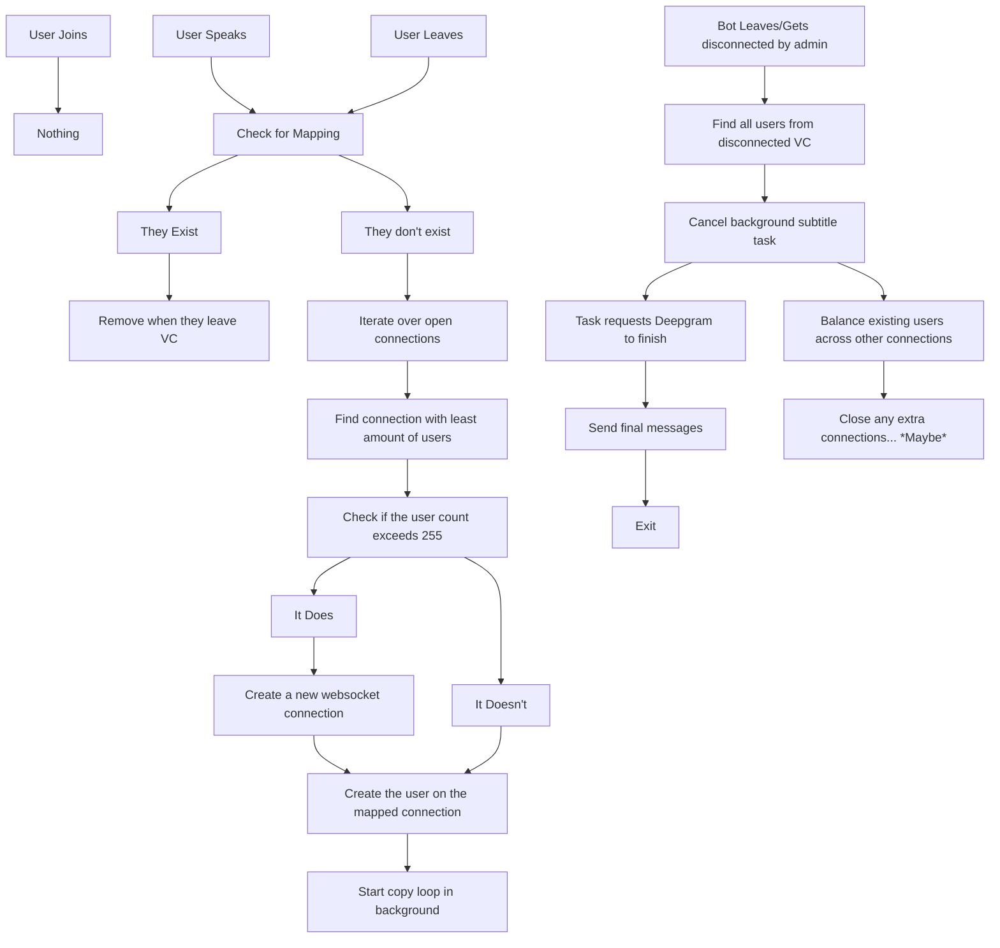

# Day 4
## Summary
Planning out the transcriber mapper is a headache. But DSharpPlus.VoiceLink now supports disconnecting. The bot can now leave voice channels and send the invite command with the correct required permissions being requested.

## Table of Contents

## Details

### `DSharpPlus.VoiceLink`
Sometimes when you get into the nitty gritty of a project, you forget to finish all the features. Like you just hyper-focus on the logic of a function and forget to create new ones. That's exactly what happened with `DSharpPlus.VoiceLink` - I was so focused on implementing everything in the voice gateway that I forgot to implement a disconnect method, like it was just completely missing. So I added that in today. I also forgot to turn pending connections into actual connections, which previously made it impossible to figure out if a bot was in a vc or not.

- [x] Add `DisconnectAsync` to `VoiceLinkConnection`
- [x] Fix `VoiceLinkConnection.Connections` not being updated.

### Transcriber Mapper
OhMyGodThisClassIsAMess.

Right now, we only have two restrictions:
- A connection can have 255 users at most.
- There can only be 100 connections at most.

Fundementally, this is how the bot plans to manage it's users:
- If connection A and connection B can join together, they will.
- If a user leaves/bot disconnects, the bot will attempt to balance the users across the remaining connections.
- The application can only create new connections when all other connections are full.

Design wise... Optimizing this process will be difficult. The only serious optimization I can currently think to make is to group all users on one connection until it's full, then create a new connection. This means I can easily append new users to the end of the connection's list instead of searching for available connections.

The issue is when user's leave. Any user can leave any time from any connection; there is zero predictability with existing users. When the user leaves or a bot disconnects, I'll have to move *all*  users. We shouldn't create new connections for each voice channel/guild as that'll exhaust the 100 connection limit.

So... How do I efficiently move all users across different connections? Ideally, we wouldn't need to move a user at all... What if we sort the users by how long they've been in a voice channel? The oldest users can stay on their own connection, being left untouched - new users or users who frequently reconnect will keep being shuffled around. This pattern sounds like a FILO queue: first in, last out. If everyone played by my non-existent rules.

I wonder if this problem is something the designers of garbage collectors face. I can only imagine the headaches they have to deal with.

---

6 days have passed since I started this update. I have made absolutely zero progress on the project, but I've made a lot of progress IRL.

However because it's been 6 days, I've gone back to the bot. I started implementing the above graph. The user mapper was simple enough to implement. Right now when adding a new user it just iterates through all the connections and grabs the first map that accepts the user. If no map accepts the user, it creates a new connection and adds the user to it. Once the connection is created, the audio loop is immediately started.

There's an issue however. Once I start sending audio - plain silence or any kind of user audio - the connection is immediately closed. My biggest suspicion is that my buffer isn't large enough, or I'm sending too much audio at once.

That is the thing though. I'm constantly sending audio. When nobody has spoken, frames of silent is sent. Perhaps I should only send audio when someone speaks and add silence frames to the other channels? While this does seem like an optimization on bandwidth, I actually think this is the correct approach anyways. If there's no audio to transcribe, why ask Deepgram to transcribe silence? It's a waste of resources on all ends.

## Conclusion

Anyways, who knows when the next update will be. My biggest roadblock is not understand Opus packets or really any audio terminlogy in general - which is something that will be a problem for a project like this.

If anyone is looking to contribute, I would like a webdev to help design the website. Sending messages to the Discord channel does seem like a simple way to send transcriptions, however the transcriptions will be coming in so fast that Discord will throttle the bot. Instead I'm going to have the transcriptions available on both Discord and in real-time via the website and a websocket connection. Feel free to reach out via GitHub issues or through Discord.